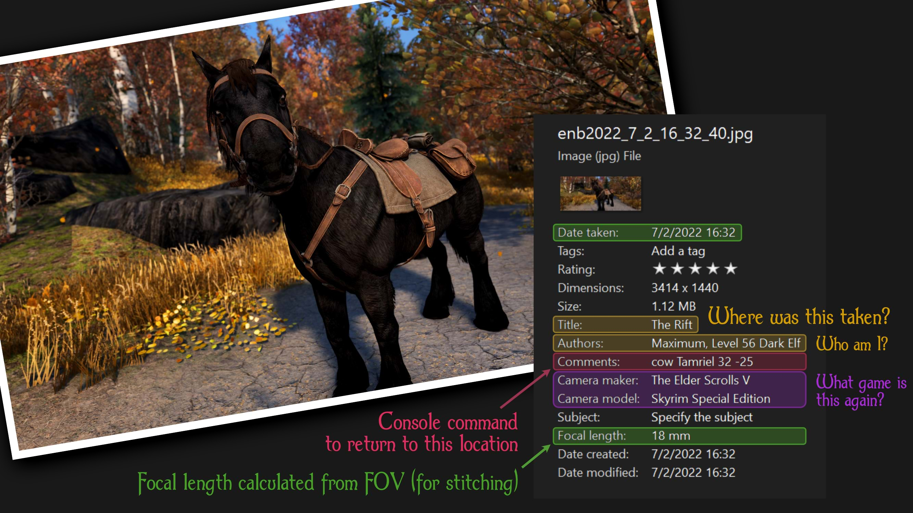

# Screenshot Location and Metadata



Changes where Skyrim screenshots are saved and adds EXIF metadata including
where the screenshot was taken, the player's name and level, the focal length
(useful for stitching in [Hugin] etc.), date taken, and a console command that
can be used to return to that spot (or nearby).

<p align="center"><a href="https://github.com/maxkagamine/ScreenshotLocationAndMetadata/releases"></a></p>

## Requirements

[.NET Script Framework]

_Recommended:_ [Unique Region Names]

## FAQ / Troubleshooting

### Where do I set the screenshot directory?

After installing the plugin, open the mod folder and edit the config file.
Example:

```properties
ScreenshotDirectory = "D:\Games\The Elder Scrolls V Skyrim\Screenshots"
```

### My PNGs don't show any metadata!

To add EXIF tags, screenshot format must be set to JPG. In enblocal.ini, set:

```ini
[FILE]
ScreenshotFormat=2
```

This option was added in [ENB v0.421][ENB]. There's a setting in the config file
to turn off metadata and only change where screenshots are saved, if you'd
rather keep PNGs (or aren't using ENB).

### My JPGs still don't show any metadata or aren't being moved!

Check the log file (NetScriptFramework.log.txt, which you'll find in the .NET
Script Framework mod folder) to see if there were any errors. Make sure also
that this mod is enabled (you should see "ScreenshotLocationAndMetadata.dll"
mentioned in the log) and that `AddMetadata` in the config file is set to True
(the default).

The code watches the game directory for new files starting with "enb" or
"ScreenShot" with the extension ".png" or ".jpg" — Steam screenshots, or those
created by other tools, are not supported.

### My exterior screenshots always say "Skyrim," not _Haafingar_ or _The Rift_ like yours!

The [Unique Region Names] mod adds region-specific names to every worldspace
cell, overriding the default "Skyrim" with names like "Whiterun Hold" or
"Riverwood". This affects load doors leading outside, the names of saves (with
the [Regional Save Names] SKSE plugin), and the location recorded in screenshot
tags.

### What's this focal length about?

When taking screenshots, you can change the field of view by entering e.g. `fov
50` in the console. Knowing what FOV was used is important when stitching
multiple screenshots into a larger image (if you haven't tried it, you can get
some really great, otherwise-impossible shots this way!).

The focal length is calculated based on the camera FOV and stored in the JPEG's
metadata, so that when the images are opened in [Hugin] (and similar tools)
it'll detect the FOV automatically. The code used for the calculation is in fact
ported directly from Hugin :)

Note: Windows displays the focal length rounded to the nearest whole number, but
it's stored in the EXIF tags as a fraction. The FOV shown in the stitching
program should be accurate to within a hundredth of a degree.

## License

Copyright 2022 Max Kagamine

This program is free software: you can redistribute it and/or modify it under
the terms of the GNU General Public License as published by the Free Software
Foundation, either version 3 of the License, or (at your option) any later
version.

This program is distributed in the hope that it will be useful, but WITHOUT ANY
WARRANTY; without even the implied warranty of MERCHANTABILITY or FITNESS FOR A
PARTICULAR PURPOSE. See the GNU General Public License for more details.

You should have received a copy of the GNU General Public License along with
this program. If not, see https://www.gnu.org/licenses/.

[.NET Script Framework]: https://www.nexusmods.com/skyrimspecialedition/mods/21294
[Unique Region Names]: https://www.nexusmods.com/skyrimspecialedition/mods/56452
[Regional Save Names]: https://www.nexusmods.com/skyrimspecialedition/mods/49698
[Hugin]: https://hugin.sourceforge.io/
[ENB]: http://enbdev.com/mod_tesskyrimse_v0475.htm
